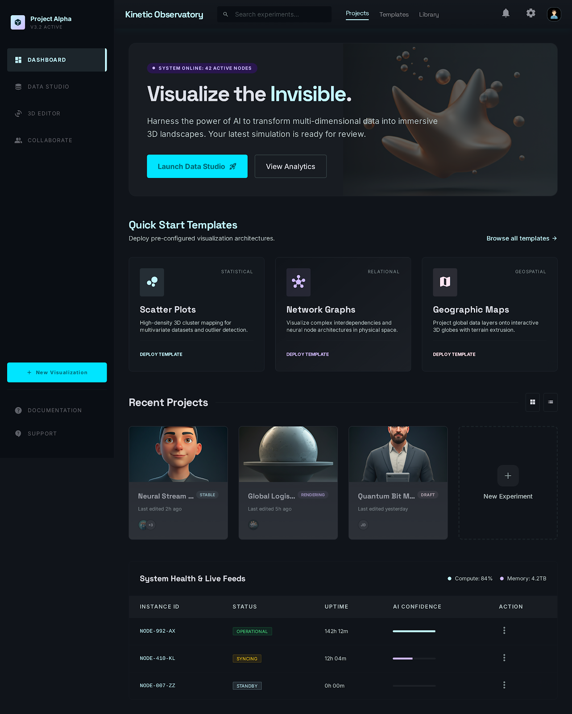

# AI-Powered 3D Data Visualization Studio



## Overview
The **AI-Powered 3D Data Visualization Studio** is a cutting-edge platform designed to transform complex, multi-dimensional datasets into immersive, interactive 3D landscapes. By harnessing the power of Artificial Intelligence and advanced rendering technologies, this system allows users to _"Visualize the Invisible"_—revealing hidden patterns, anomalies, and correlations in data that traditional 2D graphs cannot capture.

## Purpose & Motive
The motive behind this system is to bridge the gap between complex data science and intuitive human understanding. Modern enterprises generate massive amounts of data, yet standard dashboards (bar charts, line graphs) often fail to convey the multi-layered depth of this information. 

This studio was developed to:
1. **Reduce cognitive load** when analyzing high-dimensional data.
2. **Leverage AI** to automate tedious data-cleaning tasks (like handling missing values and outlier normalization).
3. **Provide spatial context** to data through 3D visualization, making it easier for human brains to intuitively spot clusters, trends, and topological anomalies.

## What Can You Achieve?
With this project, organizations, analysts, and data scientists can:
- **Discover Unknown Patterns**: Use 3D spatial mapping to find unexpected correlations easily.
- **Save Time with AI Data Prep**: The built-in "Smart Clean Insight Engine" automatically prepares raw data for rendering.
- **Analyze Data Distributions**: Review deep Data Quality Reports and Data Distribution Analyses before rendering.
- **Collaborate in Real-Time**: Deploy and share interactive 3D spaces instead of presenting static, flat PDFs.
- **Monitor System Health**: Track live computational feeds, memory usage, and node health dynamically from a centralized dashboard.

## Core Features
### 1. The Dashboard (Command Center)
A unified interface to monitor active data pipelines, review computational health metrics (compute load, memory usage), and manage "Active Nodes" (e.g., NODE-992-AX) in real-time. Features Quick Start Templates to instantly deploy pre-configured visualization architectures.

### 2. The Data Studio & Ingestion Engine
- **Drag & Drop Engine**: Upload raw `.CSV` or `.JSON` datasets securely.
- **AI Smart Clean Engine**: Topologically analyzes uploaded schemas in real-time. It provides automated suggestions such as interpolating missing null values and Z-Score signal scaling.
- **Data Quality Report & Distribution Analysis**: Get detailed views of your dataset's variance, completeness, and skewness prior to 3D rendering.

### 3. Comprehensive 3D Chart Libraries
Interact with your data using immersive web-based 3D graphics, built on top of a dynamic viewport normalizer that safely scales coordinates and metrics into the active WebGL rendering frustum:
- **Scatter Charts**: High-density 3D cluster mapping for multivariate datasets and outlier detection.
- **Bar Charts 3D**: Compare categorical magnitudes across a 3-dimensional plane.
- **Line Graphs 3D**: Track temporal changes or continuous variables in physical space.
- **Surface Plots**: Render complex mathematical surfaces to analyze topological terrains and regressions.
- **Asset Library Engine**: Import, preview, and organize `.obj` and architectural assets through intuitive, interactive WebGL `<Canvas>` rendering stand-ins instead of static views.

### 4. Advanced Machine Learning Simulator
Demonstrate the physical impact of data pipelines directly:
- **Dynamic Training vs Testing Scoring:** The simulator outputs independent accuracy mapping separating structural tests vs trained weights.
- **Variance-Sensitive Solvers:** Uses specifically configured `Ridge` and `Logistic Regression` algorithms to intentionally demonstrate performance degradation on "dirty" raw data.
- **Impactful Dashboard Feedback:** When you utilize the Data Studio to interpolate NULLs or normalize variance, you immediately visually trace a massive "After Cleaning" statistical score surge, complete with generated **Confusion Matrix metrics**.
- **Categorical & Numeric Mode Imputations**: Dynamically processes multi-modal statistics beyond raw numeric arrays.

### 5. Collaboration & Asset Management
- **Project Workspaces**: Seamless real-time collaboration with role-based access control (Owner, Editor, Viewer).
- **Messaging Views**: Sync internal team communications, pipeline status, and discuss data anomalies natively in the app.

## Technical Architecture & Flow

The system runs via a robust hybrid architecture:
1. **Frontend UI**: Built on React, TypeScript, and Vite. Utilizes TailwindCSS and Glassmorphism for a futuristic, immersive user interface. 
2. **3D Engine**: Uses `Three.js` via `React Three Fiber` and `Drei` to run optimized, high-performance WebGL renders directly in the browser.
3. **Backend API (Django)**: A Python Django server acts as the data ingestion pipeline, parsing uploads and returning structured, visualization-ready JSON.
4. **Asynchronous Background Processing (Celery & Redis)**: Celery reliably processes extremely large dataset uploads and AI cleaning operations in the background without locking the UI.
5. **State Management**: `Zustand` handles active user sessions, dataset streams, and 3D camera coordinates globally.

---

## Repository Structure & File Coordination

To understand how the platform breathes, here is the breakdown of the exact files and how they coordinate seamlessly to ingest, process, and render data.

### 1. Frontend (`/src`)
- **`src/components/views/*`**: Contains the main dashboard screens that users interact with.
  - `DataStudioView.tsx`: The primary ingestion point. Users drop files here.
  - `DataDistributionAnalysisView.tsx` & `DataQualityReportView.tsx`: Provide pre-render analytical summaries based on the backend's AI output.
  - `Editor3DView.tsx`: The wrapper for the 3D WebGL context.
  - `AssetLibraryView.tsx` & `CollaborateView.tsx`: Manage uploaded assets and real-time team interactions.
- **`src/components/charts/*`**: The customized 3D rendering components (`BarChart3D.tsx`, `ScatterChart.tsx`, `LineGraph3D.tsx`, `SurfacePlot.tsx`). They receive data and render it spatially.
- **`src/store/useAppStore.ts`**: The central nervous system (using Zustand). It holds the current dataset, layout states, and coordinates updates between the UI Views and the 3D Charts.
- **`src/components/Scene.tsx`**: The core React Three Fiber canvas where all the 3D chart components are mounted and animated.

### 2. Backend API (`/backend`)
- **`backend/core/settings.py` & `celery.py`**: Configuration for Django and the Celery worker queue.
- **`backend/api/views.py`**: The API endpoints receiving raw datasets from the React frontend.
- **`backend/api/models.py`**: The database schema defining how `Datasets` and analytical AI results are structured and stored.
- **`backend/api/tasks.py`**: Background asynchronous Celery workers. When large CSVs are uploaded, this file handles the AI cleaning, topological summarization, and heavy math without locking up the server.

### 3. Execution & Component Coordination Flow
The magic happens when these files work together in sequence:
1. **User Action**: The user drops a CSV into `DataStudioView.tsx`.
2. **API Request**: The React application calls the Backend API.
3. **Backend Intake**: Django's `api/views.py` receives the file. Instead of processing it instantly, it hands the workload off to `api/tasks.py`.
4. **Asynchronous Math**: Celery (using Redis as an inter-process broker) churns through the CSV, runs AI algorithms, and saves the cleaned JSON mapping to `api/models.py`.
5. **Frontend State Updates**: The frontend receives the cleaned dataset payload. `useAppStore.ts` consumes this new data and triggers a global re-render.
6. **Analytical Routing**: Data populates inside `DataQualityReportView.tsx` so the user can verify data variance.
7. **3D Rendering**: Finally, when the user opens `Editor3DView.tsx`, `Scene.tsx` mounts the scene. It reads the dataset from `useAppStore.ts` and passes it as rendering props to the customized 3D charts in `src/components/charts/`. The WebGL engine takes over, outputting the 3D visualization.

---

## Installation & Deployment (Docker)

The simplest way to run the entire stack (Frontend React, Backend Django, Celery Workers, and Redis) is via Docker Compose.

1. **Clone the repository:**
   ```bash
   git clone https://github.com/Dhruvil4625/AI-Powered-3D-Data-Visualization-Studio.git
   cd AI-Powered-3D-Data-Visualization-Studio
   ```

2. **Boot up the stack:**
   ```bash
   docker-compose up --build
   ```

3. **Access the application:**
   - **Frontend UI:** `http://localhost:5173`
   - **Backend API:** `http://localhost:8000`

---

## User Workflow (A Guide for New Users)

To understand how to utilize this platform day-to-day, follow this standard workflow:

### Step 1: System Login & Dashboard Review
- Start at the **Dashboard**. Review the health of any ongoing data pipelines and active instance nodes in the system summary. 
- You can either jump back into a "Recent Project" or click to start a **New Experiment**.

### Step 2: Data Ingestion
- Navigate to the **Data Studio**.
- Drag and drop a raw dataset (like `test.csv`) into the drop zone. The Celery Task Queue handles the parsing in the background safely.

### Step 3: Analytics & Smart Cleaning
- Review the **Data Quality Report** and **Data Distribution Analysis** tabs. The AI engine will flag extreme outliers or missing rows.
- Apply AI suggestions to auto-clean the data instead of manual spreadsheet coding.

### Step 4: Choose a Visualization Architecture
- Select your 3D view (Scatter, Bar, Line, or Surface).
- Click **"Run Pipeline"**.

### Step 5: The 3D Editor 
- Explore the data in 3D WebGL space. You can rotate, zoom, and inspect data points physically with your mouse.
- Use the **Asset Library** to bring in additional 3D models or textures.
- Use the **Collaborate** and **Messaging** views to share findings with your team in real-time.

---
_Built for the future of Data Analytics. Bringing the invisible to light._
